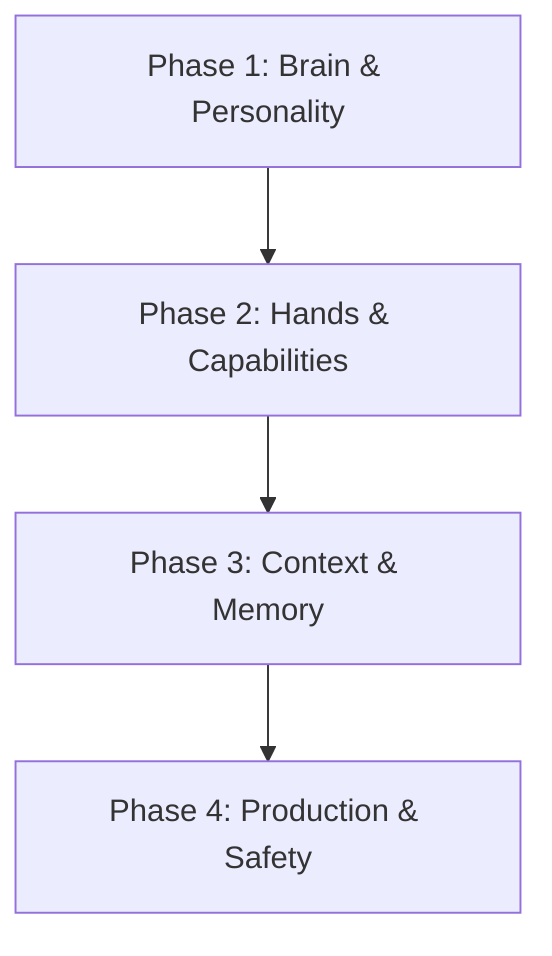

# 🤖 AI Engineering Playbook

> **"Autonomy is earned, not granted."**

This is the central engineering guide for building AI Agents and LLM-powered applications using the Antigravity Stack. It connects individual skills into a cohesive production workflow.

---

## 🏎️ The Agent Lifecycle

Building a production-grade agent is not just about writing a prompt. It requires a disciplined, multi-layered approach.

### 🔵 Phase 1: Brain & Personality (Design)

_Goal: Define behavior, boundaries, and reasoning style._

1.  **Architect the Prompt**: Don't guess. Use **[`chatgpt-project-architect`](chatgpt-project-architect/SKILL.md)** to structure your System Instructions.
    - _Key Output_: A structured Markdown file with `<Role>`, `<Constraints>`, and `<Output Format>`.
    - _Critical_: Apply "Anti-Injection" patterns from day one.

2.  **Optimize Reasoning**: If the agent needs to solve complex problems, apply **[`prompt-mastery`](prompt-mastery/SKILL.md)** techniques.
    - Use **Few-Shot Prompting** to teach by example.
    - Use **Chain-of-Thought** to force step-by-step logic before answering.

### 🟠 Phase 2: Hands & Tools (Capabilities)

_Goal: Enable the agent to interact with the world reliably._

1.  **Design the Interface**: The LLM doesn't see your code; it sees your schemas. Use **[`agent-tool-builder`](agent-tool-builder/SKILL.md)**.
    - _Rule_: Clear descriptions > Complex logic.
    - _Validation_: Every tool must have a strict JSON Schema.

2.  **Connect External Services**: Use **[`mcp-builder`](mcp-builder/SKILL.md)** to wrap APIs (like GitHub, Slack, or Databases) into standard Model Context Protocol servers.

### 🟢 Phase 3: Memory & Knowledge (Context)

_Goal: Ground the agent in reality and your specific data._

1.  **Retrieve Knowledge**: Don't rely on the model's training data. Build a RAG pipeline using **[`rag-expert`](rag-expert/SKILL.md)**.
    - _Critical_: Implement **Semantic Chunking** and **Hybrid Search** (Keywords + Embeddings).
    - _Mandatory_: Always use a Reranker step.

2.  **Architecture Choice**: Choose the right structure using **[`llm-app-patterns`](llm-app-patterns/SKILL.md)**.
    - _ReAct_: For tasks requiring reasoning loops.
    - _Plan-Execute_: For complex, multi-step goals.

### 🔴 Phase 4: Production & Safety (Guardrails)

_Goal: Deploy without sleepless nights._

1.  **Enforce Limits**: Use **[`autonomous-agent-expert`](autonomous-agent-expert/SKILL.md)** patterns.
    - Implement **Permission Levels** (Auto vs. Ask User).
    - Set strict `max_iterations` loops to prevent infinite spending.

2.  **New Skill Creation**: If you discover a new reusable pattern during dev, create a new skill using the methodology in **[`meta-skill-antigravity`](meta-skill-antigravity/SKILL.md)**.

---

## 📚 Skill Index

| Skill                                                         | Focus Area         | When to use                                             |
| :------------------------------------------------------------ | :----------------- | :------------------------------------------------------ |
| **[`prompt-mastery`](prompt-mastery/)**                       | Prompt Engineering | Optimizing prompts, Chain-of-Thought, templates         |
| **[`chatgpt-project-architect`](chatgpt-project-architect/)** | System Prompts     | Creating "Project Instructions" for specific assistants |
| **[`agent-tool-builder`](agent-tool-builder/)**               | Tools & Functions  | Designing JSON schemas for function calling             |
| **[`autonomous-agent-expert`](autonomous-agent-expert/)**     | Agent Reliability  | Building loops, safety checks, and permission systems   |
| **[`rag-expert`](rag-expert/)**                               | Knowledge/RAG      | Building retrieval pipelines, chunking, reranking       |
| **[`mcp-builder`](mcp-builder/)**                             | Connectivity       | Creating MCP servers for external tools                 |
| **[`llm-app-patterns`](llm-app-patterns/)**                   | Architecture       | High-level patterns (ReAct vs Chains vs RAG)            |
| **[`meta-skill-antigravity`](meta-skill-antigravity/)**       | Methodology        | Creating and validating new skills                      |
