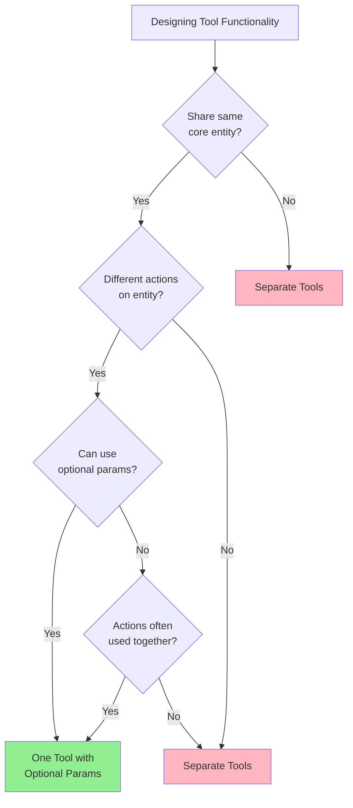
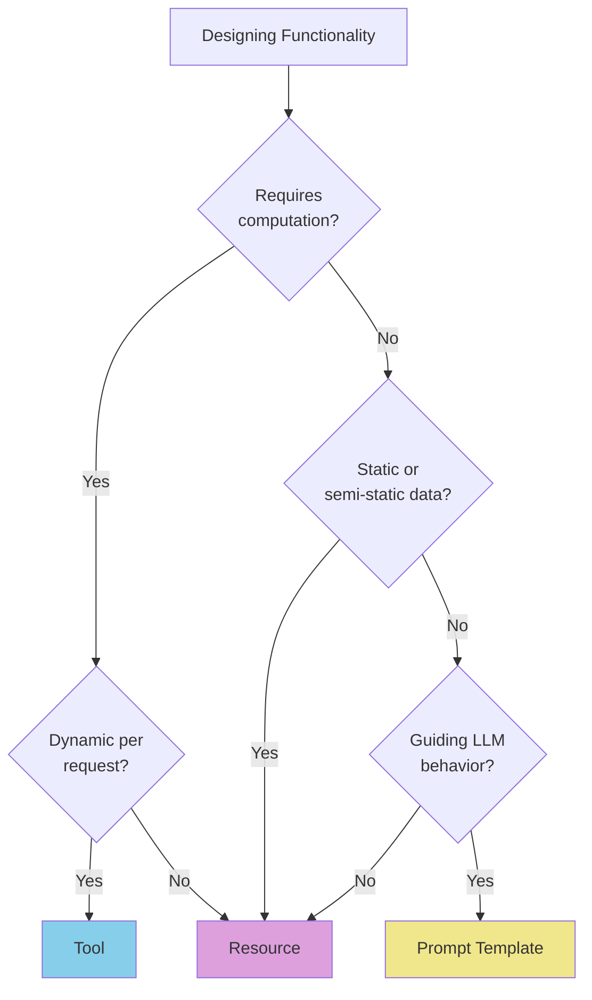
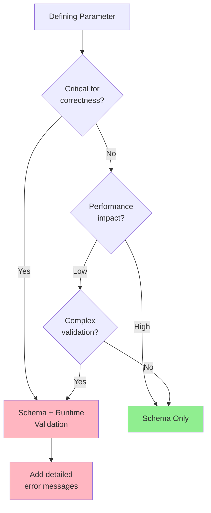
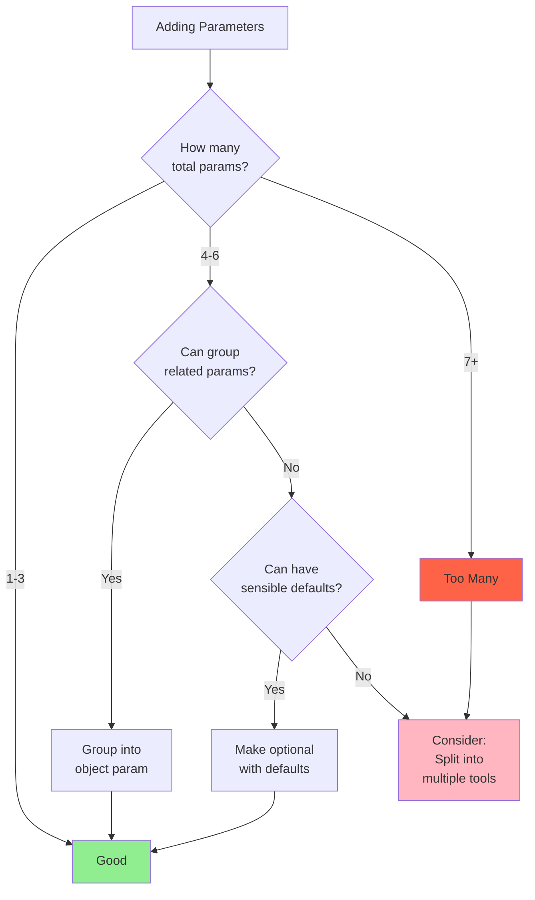
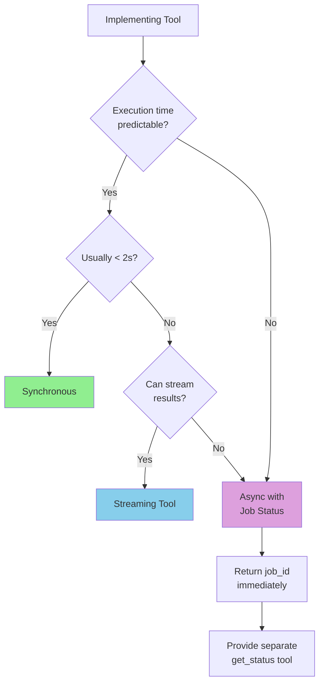
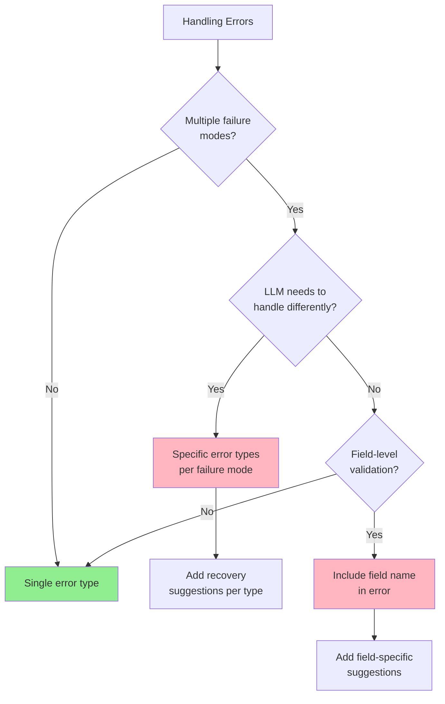
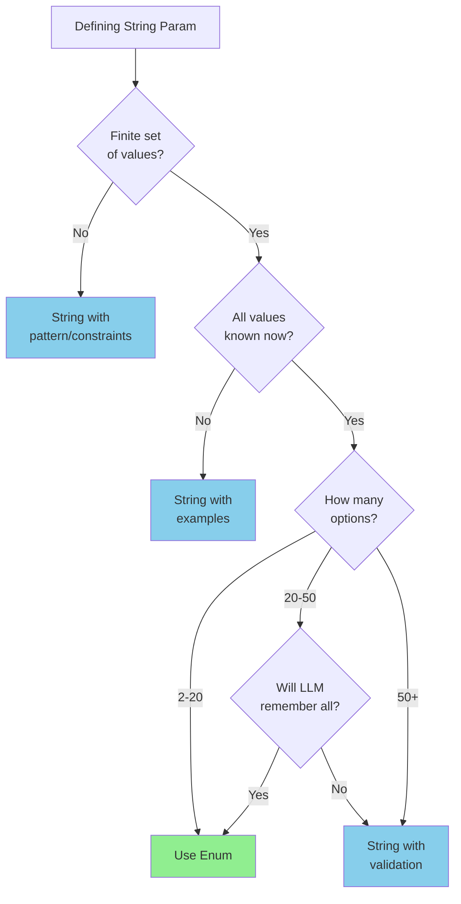
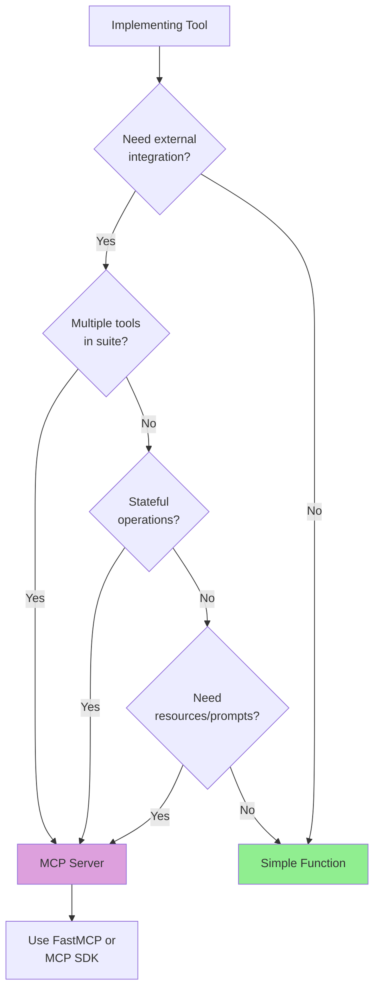

# Tool Design Decision Trees

Flowcharts to guide key decisions when designing AI agent tools.

---

## Decision 1: One Tool or Multiple?



**Examples:**

- ✅ **One tool:** `get_user(user_id?, email?, username?)` - Same entity, flexible params
- ❌ **Separate:** `search_products()` vs `create_order()` - Different entities

---

## Decision 2: Tool vs Resource vs Prompt?



**Examples:**

- **Tool:** `search_documents(query)` - Dynamic computation
- **Resource:** `schema://database-schema` - Semi-static data
- **Prompt:** `analyze-code` - Behavior template

---

## Decision 3: Validation Level?



**When to add runtime validation:**

- Cross-field dependencies
- Business logic rules
- Security checks (SQL injection, etc.)
- Format validation beyond JSON Schema

**When schema is enough:**

- Simple type checking
- Basic constraints (min/max)
- Enum validation

---

## Decision 4: Parameter Count?



**Rules of thumb:**

- **1-3 params:** Ideal, easy to understand
- **4-6 params:** OK if most have defaults
- **7+ params:** Likely doing too much, consider splitting

**Example refactoring:**

```diff
- search(query, category, min_price, max_price, sort_by, sort_order, page)
+ search(query, filters: {category, price_range}, pagination: {sort, page})
```

---

## Decision 5: Sync or Async?



**Synchronous:** Fast operations (< 2s)

- Database queries
- API calls
- Simple computations

**Async with jobs:** Long operations (> 5s)

- File processing
- Batch operations
- External service calls

**Streaming:** Progressive results

- Large dataset processing
- Real-time updates
- Chat/generation tasks

---

## Decision 6: Error Granularity?



**Error type examples:**

```python
{
  "validation_error": "User can fix input",
  "not_found": "Try different ID or list available",
  "service_unavailable": "Retry after delay",
  "permission_denied": "Check auth or request access"
}
```

**Each type should have:**

- Clear message
- Specific suggestions
- Retry guidance (if applicable)

---

## Decision 7: When to Use Enums?



**Use enum when:**

- ✅ Values are finite and known
- ✅ 2-20 options (sweet spot)
- ✅ Values won't change frequently
- ✅ Examples: status, mode, format, priority

**Don't use enum when:**

- ❌ User-generated content
- ❌ Extensible lists
- ❌ High cardinality (50+ options)
- ❌ Examples: names, messages, search queries

---

## Decision 8: MCP vs Simple Function?



**MCP Server when:**

- Multiple related tools
- Need resources (schemas, docs)
- Need prompt templates
- Stateful operations
- External service integration

**Simple Function when:**

- Single, standalone tool
- No state needed
- Internal operations only
- Quick prototyping

---

## Quick Decision Matrix

| Question                        | Answer | Recommendation                 |
| ------------------------------- | ------ | ------------------------------ |
| Same entity, different actions? | Yes    | One tool with optional params  |
| Need dynamic computation?       | Yes    | Tool (not Resource)            |
| Operation takes > 5s?           | Yes    | Async with job tracking        |
| 7+ parameters?                  | Yes    | Consider splitting or grouping |
| Finite values (2-20)?           | Yes    | Use enum                       |
| Multiple related tools?         | Yes    | MCP Server                     |
| Critical for security?          | Yes    | Schema + runtime validation    |
| Field-level errors?             | Yes    | Include field name in error    |

---

## Usage Tips

1. **Start simple:** Begin with synchronous, single-tool approach
2. **Iterate based on usage:** Add complexity only when needed
3. **Test with LLM:** Decisions should make sense to the LLM, not just developers
4. **Follow patterns:** Consistency across tools reduces token usage
5. **Document decisions:** Explain why you chose specific approach

**Remember:** Good tool design makes the agent's job easier, not harder.
