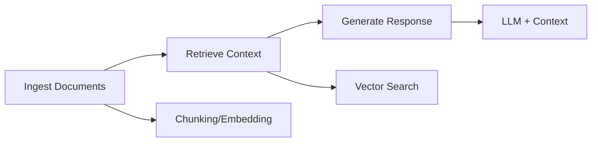

# 🤖 LLM Application Patterns

> Production-ready patterns for building LLM applications, inspired by [Dify](https://github.com/langgenius/dify) and industry best practices.

## When to Use This Skill

Use this skill when:

- Designing LLM-powered applications
- Implementing RAG (Retrieval-Augmented Generation)
- Building AI agents with tools
- Setting up LLMOps monitoring
- Choosing between agent architectures

---

## 1. RAG Pipeline Architecture

RAG (Retrieval-Augmented Generation) grounds LLM responses in your data.

### 1.1 Document Ingestion & Chunking

Strategies include Fixed-size, Semantic, Recursive, and Document-aware splitting.
👉 **[View Code Example: Chunking Strategies](examples/rag_pipeline.py#L3)**

### 1.2 Embedding & Storage

Selecting the right Vector DB (Pinecone, Weaviate, Chroma, Pgvector) and Embedding Model.
👉 **[View Code Example: Vector DB & Embeddings](examples/rag_pipeline.py#L26)**

### 1.3 Retrieval Strategies

- **Semantic Search**: Standard embedding similarity.
- **Hybrid Search**: Semantic + Keyword (BM25) with Reciprocal Rank Fusion (RRF).
- **Multi-query**: Generating variations for better recall.
- **Contextual Compression**: Filtering relevant parts before generation.
  👉 **[View Code Example: Retrieval Logic](examples/rag_pipeline.py#L70)**

### 1.4 Generation with Context

Prompting the LLM with retrieved context and handling citations.
👉 **[View Code Example: RAG Generation](examples/rag_pipeline.py#L125)**

---

## 2. Agent Architectures

### 2.1 ReAct Pattern (Reasoning + Acting)

The agent interleaves thought, action, and observation steps to solve reasoning tasks.
👉 **[View Code Example: ReAct Agent](examples/agent_architectures.py#L1)**

### 2.2 Function Calling Pattern

Using structured tool definitions (JSON schema) natively supported by LLMs (OpenAI, Anthropic).
👉 **[View Code Example: Function Calling](examples/agent_architectures.py#L52)**

### 2.3 Plan-and-Execute Pattern

Separating planning (high-level steps) from execution (doing the work) to handle complex, long-horizon tasks.
👉 **[View Code Example: Plan-and-Execute](examples/agent_architectures.py#L115)**

### 2.4 Multi-Agent Collaboration

Specialized agents (Researcher, Writer, Critic) working together with a coordinator.
👉 **[View Code Example: Multi-Agent Team](examples/agent_architectures.py#L152)**

---

## 3. Prompt IDE Patterns

### 3.1 Prompt Templates with Variables

Managing dynamic prompts with validation and few-shot examples.
👉 **[View Code Example: Prompt Templates](examples/prompt_patterns.py#L3)**

### 3.2 Prompt Versioning & A/B Testing

Tracking prompt versions, running A/B tests, and recording outcomes.
👉 **[View Code Example: Prompt Registry](examples/prompt_patterns.py#L38)**

### 3.3 Prompt Chaining

Sequencing multiple prompts where the output of one becomes the input of the next (e.g., Research -> Analyze -> Summarize).
👉 **[View Code Example: Prompt Chaining](examples/prompt_patterns.py#L68)**

---

## 4. LLMOps & Observability

### 4.1 Metrics to Track

Key metrics include Latency (p50/p99), Quality (satisfaction, hallucination), Cost, and Reliability.
👉 **[View Code Example: Metrics Dictionary](examples/llmops.py#L4)**

### 4.2 Logging & Tracing

Structured logging of requests/responses and distributed tracing (OpenTelemetry) to visualize chains.
👉 **[View Code Example: Logging & Tracing](examples/llmops.py#L27)**

### 4.3 Evaluation Framework

Systematically scoring responses for Relevance, Coherence, Groundedness, and Accuracy.
👉 **[View Code Example: Custom Evaluator](examples/llmops.py#L88)**

---

## 5. Production Patterns

### 5.1 Caching Strategy

Semantic or exact caching (Redis) to reduce costs and latency for repeated queries.
👉 **[View Code Example: LLM Cache](examples/production_patterns.py#L7)**

### 5.2 Rate Limiting & Retry

Handling API limits and transient errors with exponential backoff strategies.
👉 **[View Code Example: Rate Limiter & Retry](examples/production_patterns.py#L39)**

### 5.3 Fallback Strategy

Automatically switching to cheaper/faster or more capable models when the primary model fails.
👉 **[View Code Example: Model Fallback](examples/production_patterns.py#L83)**

---

## Architecture Decision Matrix

| Pattern              | Use When         | Complexity | Cost      |
| :------------------- | :--------------- | :--------- | :-------- |
| **Simple RAG**       | FAQ, docs search | Low        | Low       |
| **Hybrid RAG**       | Mixed queries    | Medium     | Medium    |
| **ReAct Agent**      | Multi-step tasks | Medium     | Medium    |
| **Function Calling** | Structured tools | Low        | Low       |
| **Plan-Execute**     | Complex tasks    | High       | High      |
| **Multi-Agent**      | Research tasks   | Very High  | Very High |

---

## Resources

- [Dify Platform](https://github.com/langgenius/dify)
- [LangChain Docs](https://python.langchain.com/)
- [LlamaIndex](https://www.llamaindex.ai/)
- [Anthropic Cookbook](https://github.com/anthropics/anthropic-cookbook)
