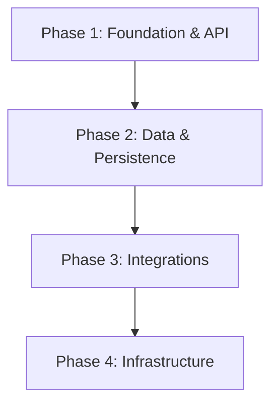

# ⚙️ Backend Engineering Playbook

> **"Scalability is not a feature; it is an architectural decision."**

This playbook guides you through building robust, scalable backend systems. It moves from high-level architecture to specific database optimizations and infrastructure choices.

---

## 🏗️ The Backend Lifecycle

A great backend is built in layers, starting from the API contract down to the metal (containers).

### 🏰 Phase 1: Foundation & Architecture

_Goal: Define how the system communicates and organizes logic._

1.  **Define the Contract**: Before writing code, agree on the interface using **[`api-patterns`](api-patterns/SKILL.md)**.
    - _Standard_: REST vs GraphQL? Versioning strategy?
    - _Constraint_: Always define error envelope formats first.

2.  **Choose the Framework**:
    - **General**: Use **[`backend-expert`](backend-expert/SKILL.md)** for language-agnostic patterns (Layered Architecture, SOLID).
    - **Node.js**: Use **[`nestjs-expert`](nestjs-expert/SKILL.md)** for structured, modular applications. Enforce Dependency Injection and strictly separate Controllers from Services.

### 💾 Phase 2: Data & Persistence

_Goal: Store data reliably and efficiently._

1.  **Design the Schema**: Use **[`database-design`](database-design/SKILL.md)** before running `CREATE TABLE`.
    - _Normalization_: 3NF by default, denormalize only for read-heavy hotspots.
    - _Keys_: UUIDs vs Integers? Foreign Key constraints are mandatory.

2.  **Optimize the Engine**: If using PostgreSQL (recommended), apply **[`postgres-best-practices`](postgres-best-practices/SKILL.md)**.
    - _Performance_: Indexing strategies (B-Tree, GIN for JSONB).
    - _Safety_: Tuning autovacuum and connection pooling (PgBouncer).

### 🔌 Phase 3: Integrations

_Goal: Talk to the outside world._

1.  **External Ecosystems**: When connecting to complex third parties, don't reinvent the wheel.
    - **MercadoLibre**: Use **[`mercadolibre-api`](mercadolibre-api/SKILL.md)** for handling auth (OAuth) and rate limits specifically for the MELI ecosystem.

### 🐳 Phase 4: Infrastructure & DevOps

_Goal: Run anywhere, consistently._

1.  **Containerize**: "It works on my machine" is unacceptable. Use **[`docker-expert`](docker-expert/SKILL.md)**.
    - _Optimization_: Multi-stage builds for small images.
    - _Orchestration_: Docker Compose for local dev, tailored for production readiness.

---

## 📚 Skill Index

| Skill                                                     | Focus Area         | When to use                                                 |
| :-------------------------------------------------------- | :----------------- | :---------------------------------------------------------- |
| **[`api-patterns`](api-patterns/)**                       | API Design         | Defining REST/GraphQL contracts, versioning, error handling |
| **[`backend-expert`](backend-expert/)**                   | Architecture       | General best practices, SOLID, Clean Architecture           |
| **[`nestjs-expert`](nestjs-expert/)**                     | Node.js Framework  | Building scalable applications with NestJS                  |
| **[`database-design`](database-design/)**                 | Data Modeling      | Schema design, normalization, ERD diagrams                  |
| **[`postgres-best-practices`](postgres-best-practices/)** | Database Specifics | Tuning, indexing, and advanced PostgreSQL features          |
| **[`mercadolibre-api`](mercadolibre-api/)**               | Integration        | Connecting with MercadoLibre APIs (MELI)                    |
| **[`docker-expert`](docker-expert/)**                     | DevOps             | Containerization, Dockerfiles, docker-compose               |
