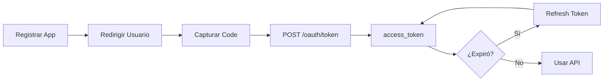

# Integración con API de Mercado Libre

## Quick Start

### 1. Identificar Caso de Uso

| Necesidad        | Endpoint/Recurso                                                             |
| ---------------- | ---------------------------------------------------------------------------- |
| Autenticar OAuth | [oauth-guide.md](references/oauth-guide.md)                                  |
| Buscar productos | `GET /sites/{SITE}/search?q={query}`                                         |
| Publicar item    | `POST /items`                                                                |
| Órdenes          | `GET /orders/search?seller={ID}`                                             |
| Preguntas        | `GET /questions/search?item={ID}`                                            |
| Webhooks         | [code-examples.md#webhooks](references/code-examples.md#configurar-webhooks) |

### 2. Flujo de Autenticación



**Detalles completos:** [oauth-guide.md](references/oauth-guide.md)

### 3. Endpoints Básicos

```bash
# Búsqueda (sin auth)
GET https://api.mercadolibre.com/sites/MLA/search?q=notebook

# Item específico (sin auth)
GET https://api.mercadolibre.com/items/{ITEM_ID}

# Operaciones autenticadas (requieren Bearer token)
GET https://api.mercadolibre.com/orders/search?seller={ID}
POST https://api.mercadolibre.com/items
POST https://api.mercadolibre.com/answers
```

**Ejemplos completos:** [code-examples.md](references/code-examples.md)

---

## Troubleshooting Rápido

| Error | Causa            | Solución Rápida                 |
| ----- | ---------------- | ------------------------------- |
| 401   | Token expirado   | Renovar con refresh_token       |
| 403   | Sin permisos     | Verificar scopes de app         |
| 429   | Rate limit       | Implementar backoff exponencial |
| 400   | Payload inválido | Validar campos requeridos       |

**Soluciones detalladas:** [error-handling.md](references/error-handling.md)

---

## Sites Disponibles

| País      | Site ID | Dominio Auth |
| --------- | ------- | ------------ |
| Argentina | MLA     | `.com.ar`    |
| Brasil    | MLB     | `.com.br`    |
| México    | MLM     | `.com.mx`    |
| Chile     | MLC     | `.cl`        |
| Colombia  | MCO     | `.com.co`    |
| Uruguay   | MLU     | `.com.uy`    |

---

## Webhooks

### Topics Disponibles

- `orders_v2` - Cambios en órdenes
- `items` - Cambios en publicaciones
- `questions` - Nuevas preguntas
- `messages` - Mensajes de compradores
- `claims` - Reclamos

### Setup Rápido

1. Configurar endpoint HTTPS en tu servidor
2. Registrar URL en app: `PUT /applications/{APP_ID}`
3. Suscribirse a topics: `POST /applications/{APP_ID}/subscriptions`

**Ejemplos completos:** [code-examples.md#webhooks](references/code-examples.md#configurar-webhooks)

---

## Constraints

### Seguridad

- **Nunca exponer** `client_secret` o `access_token` en código versionado
- **Usar variables de entorno** para credenciales
- **HTTPS obligatorio** para redirect URIs y webhooks

### Operaciones Críticas

> [!CAUTION]
> Confirmar antes de:
>
> - Pausar/eliminar publicaciones masivamente
> - Cambiar precios de múltiples items
> - Cancelar órdenes

### Rate Limits

- Consultas públicas: ~10,000/día
- Implementar **exponential backoff** para 429
- Preferir **webhooks** sobre polling

---

## Resources

- **Base URL:** `https://api.mercadolibre.com`
- **Docs oficiales:** https://developers.mercadolibre.com/
- **SDKs:** npm `mercadolibre`, Maven (oficial), pip (no oficial)

### Referencias Detalladas

- [OAuth Guide](references/oauth-guide.md) - Flujo completo de autenticación
- [Code Examples](references/code-examples.md) - Ejemplos en bash, Node.js, Python
- [Error Handling](references/error-handling.md) - Tabla de errores y soluciones
