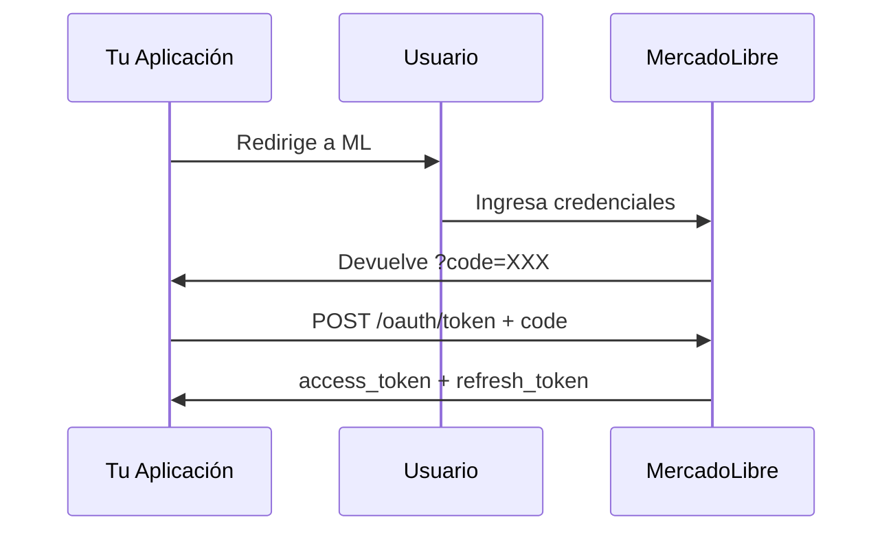

# Guía de Autenticación OAuth 2.0 - MercadoLibre

## Flujo Completo de Autorización



## Paso 1: Registrar Aplicación

1. Ir a https://developers.mercadolibre.com/
2. Crear nueva aplicación
3. Configurar **Redirect URI** (debe ser HTTPS en producción)
4. Copiar `APP_ID` y `SECRET_KEY`

## Paso 2: Obtener Código de Autorización

Redirigir al usuario a:

```
https://auth.mercadolibre.com.ar/authorization
  ?response_type=code
  &client_id={APP_ID}
  &redirect_uri={REDIRECT_URI}
```

**Países disponibles:**

- `.com.ar` - Argentina (MLA)
- `.com.br` - Brasil (MLB)
- `.com.mx` - México (MLM)
- `.cl` - Chile (MLC)
- `.com.co` - Colombia (MCO)
- `.com.uy` - Uruguay (MLU)

## Paso 3: Intercambiar Código por Token

```bash
curl -X POST 'https://api.mercadolibre.com/oauth/token' \
  -H 'Content-Type: application/x-www-form-urlencoded' \
  -d 'grant_type=authorization_code' \
  -d 'client_id={APP_ID}' \
  -d 'client_secret={SECRET_KEY}' \
  -d 'code={AUTH_CODE}' \
  -d 'redirect_uri={REDIRECT_URI}'
```

**Respuesta exitosa:**

```json
{
  "access_token": "APP_USR-xxx",
  "token_type": "Bearer",
  "expires_in": 21600,
  "scope": "read write offline_access",
  "user_id": 123456789,
  "refresh_token": "TG-xxx"
}
```

## Paso 4: Renovar Token Expirado

El `access_token` expira en **6 horas**. Usar `refresh_token` para renovar:

```bash
curl -X POST 'https://api.mercadolibre.com/oauth/token' \
  -H 'Content-Type: application/x-www-form-urlencoded' \
  -d 'grant_type=refresh_token' \
  -d 'client_id={APP_ID}' \
  -d 'client_secret={SECRET_KEY}' \
  -d 'refresh_token={REFRESH_TOKEN}'
```

> [!WARNING]
> El `refresh_token` también expira. Si expira, el usuario debe re-autorizar.

## Paso 5: Usar Token en Requests

```bash
curl -X GET 'https://api.mercadolibre.com/users/me' \
  -H 'Authorization: Bearer {ACCESS_TOKEN}'
```

---

## Mejores Prácticas

| Práctica               | Implementación                         |
| ---------------------- | -------------------------------------- |
| Almacenar tokens       | Variables de entorno o secrets manager |
| Renovar proactivamente | Renovar 5 min antes de expirar         |
| Manejar revocación     | Capturar 401 y re-autorizar            |
| Multi-tenant           | Almacenar token por usuario/cuenta     |
