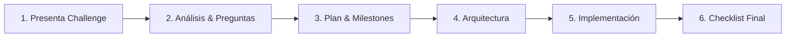

# 🎯 React Exam Copilot

> **Senior React Frontend Exam Copilot** - Tu copiloto experto para resolver exámenes técnicos y coding challenges de nivel Senior.

---

## 📋 Qué es

Un skill especializado para ayudarte a:

- ✅ Resolver coding challenges de entrevistas técnicas
- ✅ Practicar exámenes de nivel Senior Frontend (React/TypeScript)
- ✅ Recibir feedback de calidad senior sobre tu código
- ✅ Aprender patrones y mejores prácticas mientras resuelves

---

## 📂 Estructura del Skill

```
react-exam-copilot/
├── SKILL.md              # Core skill (prompt principal)
├── README.md             # Este archivo
├── checklists/           # Checklists de verificación
│   ├── accessibility.md  # ARIA, teclado, focus, contraste
│   ├── performance.md    # Memoización, renders, lazy loading
│   └── code-review.md    # Estructura, patrones, mejoras
├── patterns/             # Patrones Senior React
│   ├── custom-hooks.md
│   ├── compound-components.md
│   ├── error-boundaries.md
│   ├── data-fetching.md
│   ├── state-management.md
│   └── testing-patterns.md
└── templates/            # Templates reutilizables
    ├── component.tsx
    ├── custom-hook.tsx
    ├── test-setup.tsx
    ├── error-boundary.tsx
    └── readme-challenge.md
```

---

## 🚀 Modos de Operación

| Modo                           | Cuándo usarlo          | Comportamiento                                           |
| :----------------------------- | :--------------------- | :------------------------------------------------------- |
| **🎓 Entrenamiento** (default) | Práctica, aprendizaje  | Soluciones completas con explicaciones detalladas        |
| **🔒 Examen Real**             | Durante un examen real | Guía con hints y checklists, sin dar respuestas directas |

> **Tip**: Siempre especifica el modo cuando inicies una sesión de challenge.

---

## 🔄 Flujo de Trabajo



### Detalle de cada fase:

1. **Presenta el challenge** → El copiloto analiza y resume en 3-5 bullets
2. **Preguntas de aclaración** → Solo si faltan datos críticos
3. **Plan incremental** → Milestones claros y verificables
4. **Arquitectura** → Componentes, estado, estilos propuestos
5. **Implementación** → Paso a paso con explicación y verificación
6. **Checklist final** → Accesibilidad, performance, tests, DX

---

## ✅ Checklists Incluidos

| Checklist         | Qué verifica                                                              |
| :---------------- | :------------------------------------------------------------------------ |
| **Accessibility** | Roles ARIA, navegación por teclado, focus visible, labels, contraste WCAG |
| **Performance**   | Memoización, evitar re-renders, lazy loading, bundle size                 |
| **Testing**       | Unit tests, integration tests, edge cases                                 |
| **Code Quality**  | TypeScript estricto, error boundaries, loading/error states               |

---

## 💡 Uso

### En Antigravity/Cursor/Windsurf

El skill se activa automáticamente cuando trabajas en un challenge de React. Puedes invocar explícitamente con:

```
Activa react-exam-copilot en modo Entrenamiento para este challenge...
```

### Exportable a CustomGPT

El `SKILL.md` es compatible como System Prompt en:

- OpenAI CustomGPT
- Claude Projects
- Gemini
- Cualquier LLM que soporte system prompts

---

## 📝 Tips para mejores resultados

1. **Especifica el modo** → Entrenamiento o Examen Real
2. **Comparte el enunciado completo** → Mejor contexto = mejor ayuda
3. **Pide explicación de tradeoffs** → Aprende el "por qué" detrás de cada decisión
4. **Usa los checklists antes de entregar** → Evita errores comunes
5. **Trabaja por milestones** → Un paso a la vez, verificando antes de avanzar

---

## 🔗 Recursos Relacionados

- [`react-frontend-patterns`](../react-frontend-patterns/) - Hooks & Composition patterns
- [`react-ui-patterns`](../react-ui-patterns/) - Design Systems & Components
- [`typescript-expert`](../../languages-standards/typescript-expert/) - Strict typing patterns

---

_Parte del [Antigravity Developer Stack](../../README.md) • Frontend Engineering Playbook_
