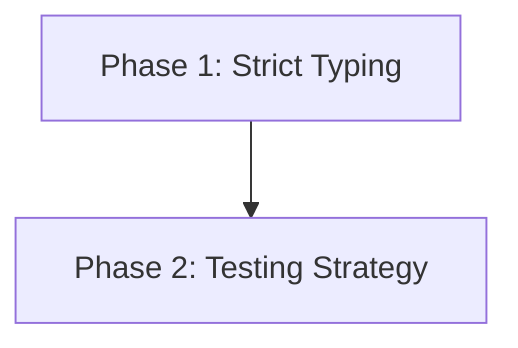

# 📏 Code & Quality Playbook

> **"If it's not typed, it doesn't exist. If it's not tested, it's broken."**

This playbook establishes the non-negotiable standards for code quality across the entire stack. Use these skills to write code that documents itself and refuses to break.

---

## 🛡️ The Quality Lifecycle

Quality isn't a "testing phase"; it's a continuous process that starts with the first line of code.

### 🔷 Phase 1: Strict Typing (The First Defense)

_Goal: Catch errors at compile time, not runtime._

1.  **TypeScript by Default**: There is no "Vanilla JS" in this stack. Use **[`typescript-expert`](typescript-expert/SKILL.md)**.
    - _No `any`_: Use `unknown` if you must, and cast safely later.
    - _Generics_: Learn to use `T` to create reusable, type-safe utilities.
    - _Zod/Io-Ts_: Use runtime validation at the edges (API inputs), static typing internally.

### 🧪 Phase 2: Testing Strategy (The Safety Net)

_Goal: Sleep well at night._

1.  **TDD Mindset**: Use **[`testing-patterns`](testing-patterns/SKILL.md)**.
    - _Unit Tests_: Test pure logic (utils, helpers) extensively. Jest/Vitest.
    - _Integration_: Test the flow (API -> DB). Don't mock the database unless you have to.
    - _E2E_: Test the critical user journey. Keep these few but robust.

---

## 📚 Skill Index

| Skill                                         | Focus Area  | When to use                                              |
| :-------------------------------------------- | :---------- | :------------------------------------------------------- |
| **[`typescript-expert`](typescript-expert/)** | Type Safety | Advanced types, generics, strict config patterns         |
| **[`testing-patterns`](testing-patterns/)**   | QA & TDD    | Unit/Integration testing strategies, mocking, assertions |
