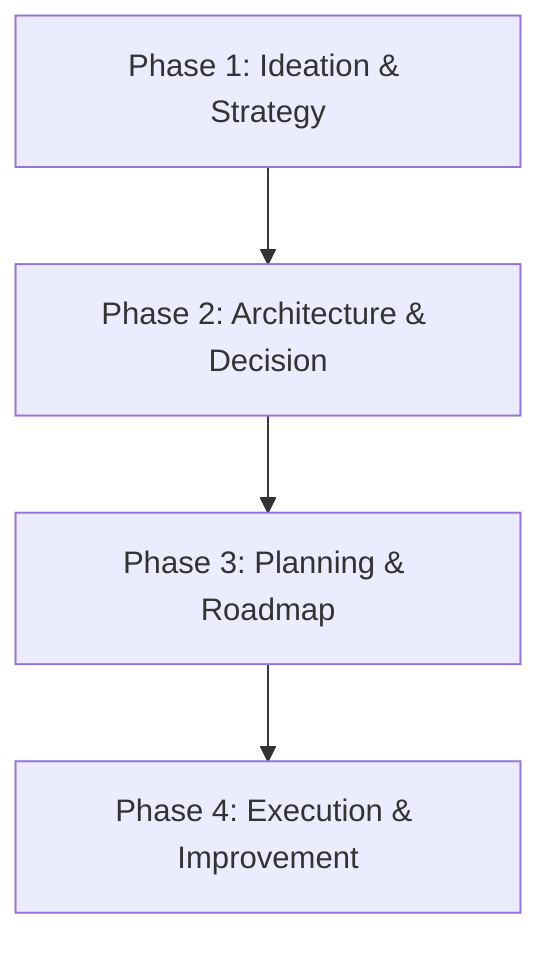

# 🧠 Strategy & Architecture Playbook

> **"If you fail to plan, you are planning to fail."**

This playbook covers the "Meta" layer of software development: deciding _what_ to build, _why_ to build it, and _how_ to architect it before writing a single line of code.

---

## 🚀 The Vision-to-Execution Lifecycle

Great software starts on a whiteboard, not in an IDE.

### 💡 Phase 1: Ideation & Strategy (The "Why")

_Goal: Validate the idea and define value._

1.  **Unlock Creativity**: Use **[`brainstorming`](brainstorming/SKILL.md)** to generate ideas or solve blockers.
    - _Techniques_: SCAMPER, First Principles, Inversion.

2.  **Define the Market**: Use **[`marketing-ideas`](marketing-ideas/SKILL.md)** and **[`pricing-strategy`](pricing-strategy/SKILL.md)** early.
    - _Rule_: If you can't define who pays or how they pay, you don't have a product yet.

3.  **Prototype Fast**: Use **[`app-builder`](app-builder/SKILL.md)** to map the MVP.
    - _Focus_: Core Value Proposition only. Everything else is distraction.

### 🏗️ Phase 2: Architecture & Decision (The "What")

_Goal: Design a system that survives success._

1.  **System Design**: Use **[`senior-architect`](senior-architect/SKILL.md)**.
    - _Deliverables_: C4 Diagrams, ERDs, Tech Stack Decision Records (ADRs).
    - _Mindset_: Analyze trade-offs. "Microservices" is not always the answer.

### 📅 Phase 3: Planning & Roadmap (The "When")

_Goal: Create a realistic path to delivery._

1.  **Break it Down**: Use **[`planning-expert`](planning-expert/SKILL.md)**.
    - _Technique_: Work backwards from the release date.
    - _Estimation_: Use T-Shirt sizing for broad strokes, precise hours for the next sprint only.

### 🔄 Phase 4: Execution & Improvement (The "How")

_Goal: Better every day._

1.  **Continuous Improvement**: Use **[`kaizen`](kaizen/SKILL.md)**.
    - _Workflow_: Regular retrospectives. Fix the _process_, not just the _bug_.

---

## 📚 Skill Index

| Skill                                       | Focus Area    | When to use                                       |
| :------------------------------------------ | :------------ | :------------------------------------------------ |
| **[`senior-architect`](senior-architect/)** | System Design | High-level decisions, tradeoff analysis, diagrams |
| **[`planning-expert`](planning-expert/)**   | Management    | Roadmapping, estimation, task breakdown           |
| **[`brainstorming`](brainstorming/)**       | Creativity    | Unblocking problems, generating feature ideas     |
| **[`app-builder`](app-builder/)**           | MVP           | End-to-end guide for building new apps            |
| **[`pricing-strategy`](pricing-strategy/)** | Business      | Determining monetization models                   |
| **[`marketing-ideas`](marketing-ideas/)**   | Growth        | Go-to-market strategies                           |
| **[`kaizen`](kaizen/)**                     | Process       | Improving team workflows and personal efficiency  |
