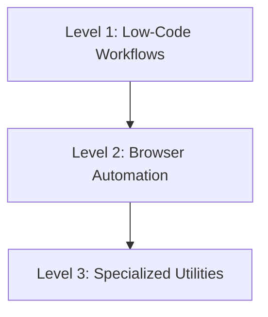

# 🛠️ Tools & Automation Playbook

> **"If you have to do it more than twice, automate it."**

This playbook covers the "Machine Labor" department of your stack. These skills are for building the robots that do the boring work so humans don't have to.

---

## 🦾 The Automation Spectrum

Choose the right tool for the job. Do not use a browser when an API exists. Do not write code when a low-code flow suffices.

### ⚡ Level 1: Low-Code Workflows (The Glue)

_Goal: Connect APIs quickly without maintaining servers._

1.  **Workflow Orchestration**: Use **[`n8n-workflow-builder`](n8n-workflow-builder/SKILL.md)**.
    - _Best For_: Webhooks, connecting SaaS (Slack -> Sheets), Cron jobs.
    - _Example_: **[`meli-n8n-crm-logger`](meli-n8n-crm-logger/SKILL.md)** shows how to log high-volume e-commerce data without writing a backend.

### 🕸️ Level 2: Browser Automation (The Heavy Lifting)

_Goal: Interact with websites that don't have APIs._

1.  **Scraping & Control**: Use **[`browser-automation-expert`](browser-automation-expert/SKILL.md)**.
    - _Principle_: Resiliency > Speed.
    - _Technique_: Always use explicit waits (`waitForSelector`). Never rely on fixed `sleep()`.
    - _Anti-Detection_: Use realistic user-agent rotation and human-like delays.

### 📄 Level 3: Specialized Utilities

_Goal: Handle complex file formats._

1.  **Document Generation**: Use **[`pdf-official`](pdf-official/SKILL.md)**.
    - _Use Case_: generating invoices, reports, or contracts programmatically.

---

## 📚 Skill Index

| Skill                                                         | Focus Area | When to use                                         |
| :------------------------------------------------------------ | :--------- | :-------------------------------------------------- |
| **[`n8n-workflow-builder`](n8n-workflow-builder/)**           | Low-Code   | Connecting APIs, event-driven workflows, cron jobs  |
| **[`browser-automation-expert`](browser-automation-expert/)** | Scraping   | Automating web interactions, testing, scraping data |
| **[`meli-n8n-crm-logger`](meli-n8n-crm-logger/)**             | E-commerce | Specific recipe for MercadoLibre CRM logging        |
| **[`pdf-official`](pdf-official/)**                           | Documents  | generating and manipulating PDF files               |
